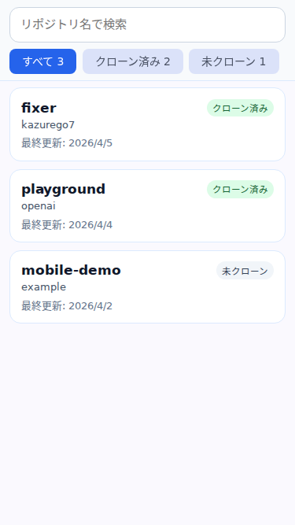
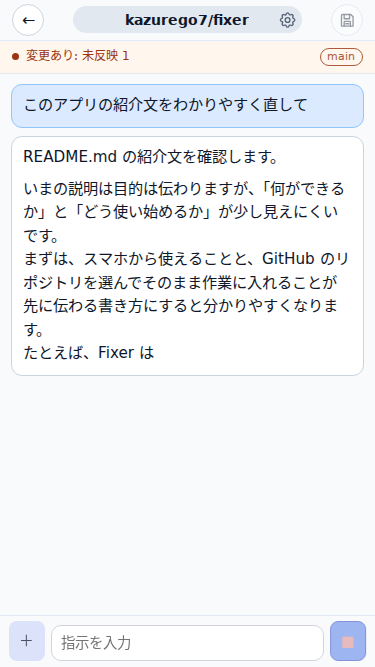
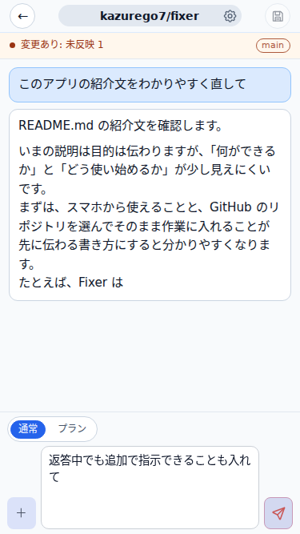
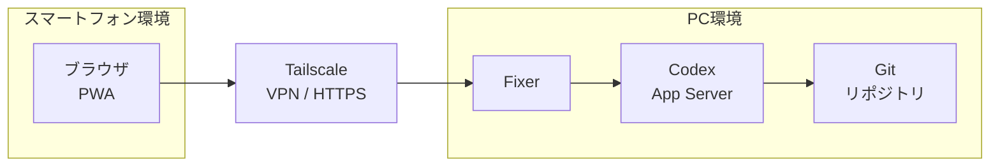

# Fixer

Fixer は、Codex用のモバイル向け Web UI です。

## 背景と目的

Codex Web は応答や確認に待ちが入りやすく、CI/CD 待ちも含めて確認ループが遅くなりやすいです。
ローカルの Codex は速い一方で、スマートフォンから SSH で CLI を扱うのは不便です。

Fixer は、ローカルで動かす Codex App Server に対してモバイル向けの Web UI を用意し、ローカルと同じ速度で確認ループを回すことを目的としています。

## 利用イメージ



GitHub リポジトリを選ぶと、必要に応じて自動で clone して、そのまま作業を始められます。





スマホから Codex に指示を出し、返答を見ながら途中で追加の指示も送れます。

## 構成



PC 環境では Fixer、Codex App Server、Git リポジトリが動きます。スマートフォン環境からは Tailscale 経由で Fixer に HTTPS アクセスし、PC 側でローカル Codex を動かします。

## 使い方

### 依存ツール

- Node.js / npm
- `codex` CLI
- `gh` CLI
- `git`
- `tailscale`

### 事前設定

- GitHub 認証（`gh auth login` 済み）

### 初回セットアップ

初回のみ、依存関係をインストールします。

```bash
npm install
```

### アプリを起動

```bash
npm run build
npm start
```

### Tailscale をインストール

PC とスマートフォンの両方に Tailscale をインストールします。

- PC: https://tailscale.com/download
- iPhone: App Store から `Tailscale` をインストール

インストール後は、同じ Tailnet にログインしておきます。

### HTTPS で公開

PC 側で次を実行します。

```bash
tailscale serve --bg 3000
```

初回は必要に応じて、Tailscale 側で HTTPS を有効化する確認が表示されます。

公開 URL は `https://<マシン名>.<tailnet>.ts.net` の形になります。

### iPhone からアクセス

1. iPhone で Tailscale にログインします。
2. Safari で公開 URL を開きます。
3. リポジトリ一覧が表示されることを確認します。

### ホーム画面に追加

Safari の共有メニューから「ホーム画面に追加」を選ぶと、PWA として起動しやすくなります。

### 通知を使う

チャット画面を開いたときに通知許可が表示されたら許可します。
通知を使う場合も、HTTPS でアクセスしている必要があります。
